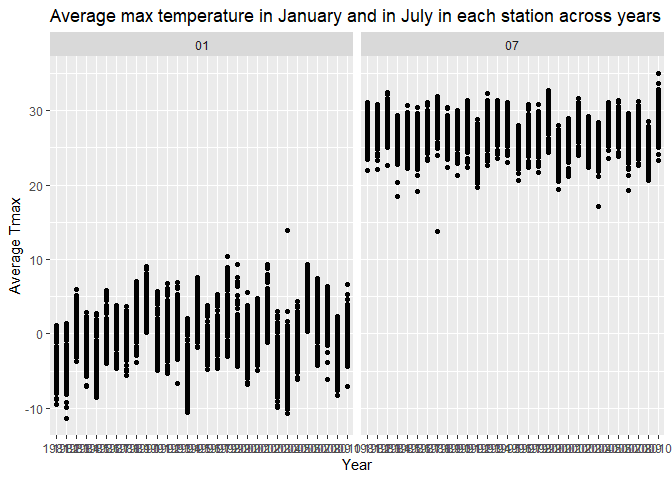

p8105_yh3555_hw3
================
Yuchen Hua
2022-10-14

### Problem 1 (solution)

#### Read in the data

``` r
data("instacart")

instacart = 
  instacart %>% 
  as_tibble(instacart)
instacart
```

    ## # A tibble: 1,384,617 × 15
    ##    order_id product_id add_to_…¹ reord…² user_id eval_…³ order…⁴ order…⁵ order…⁶
    ##       <int>      <int>     <int>   <int>   <int> <chr>     <int>   <int>   <int>
    ##  1        1      49302         1       1  112108 train         4       4      10
    ##  2        1      11109         2       1  112108 train         4       4      10
    ##  3        1      10246         3       0  112108 train         4       4      10
    ##  4        1      49683         4       0  112108 train         4       4      10
    ##  5        1      43633         5       1  112108 train         4       4      10
    ##  6        1      13176         6       0  112108 train         4       4      10
    ##  7        1      47209         7       0  112108 train         4       4      10
    ##  8        1      22035         8       1  112108 train         4       4      10
    ##  9       36      39612         1       0   79431 train        23       6      18
    ## 10       36      19660         2       1   79431 train        23       6      18
    ## # … with 1,384,607 more rows, 6 more variables: days_since_prior_order <int>,
    ## #   product_name <chr>, aisle_id <int>, department_id <int>, aisle <chr>,
    ## #   department <chr>, and abbreviated variable names ¹​add_to_cart_order,
    ## #   ²​reordered, ³​eval_set, ⁴​order_number, ⁵​order_dow, ⁶​order_hour_of_day

There are 1384617 rows and 15 columns.

## Plot

``` r
instacart %>% 
  count(aisle) %>% 
  arrange(desc(n))
```

    ## # A tibble: 134 × 2
    ##    aisle                              n
    ##    <chr>                          <int>
    ##  1 fresh vegetables              150609
    ##  2 fresh fruits                  150473
    ##  3 packaged vegetables fruits     78493
    ##  4 yogurt                         55240
    ##  5 packaged cheese                41699
    ##  6 water seltzer sparkling water  36617
    ##  7 milk                           32644
    ##  8 chips pretzels                 31269
    ##  9 soy lactosefree                26240
    ## 10 bread                          23635
    ## # … with 124 more rows

``` r
instacart %>% 
  count(aisle) %>% 
  filter(n > 10000) %>% 
  mutate(aisle = fct_reorder(aisle, n)) %>% 
  ggplot(aes(x = aisle, y = n)) + 
  geom_point() + 
  labs(title = "Number of items ordered in each aisle") +
  theme(axis.text.x = element_text(angle = 60, hjust = 1))
```

<!-- -->
According to the plot, the most popular goods are fresh vegetables,
fresh fruits and packaged vegetables fruits. \#### Table of three most
popular items

``` r
instacart %>% 
  filter(aisle %in% c("baking ingredients", "dog food care", "packaged vegetables fruits")) %>%
  group_by(aisle) %>% 
  count(product_name) %>% 
  mutate(rank = min_rank(desc(n))) %>% 
  filter(rank < 4) %>% 
  arrange(desc(n)) %>%
  knitr::kable()
```

| aisle                      | product_name                                  |    n | rank |
|:---------------------------|:----------------------------------------------|-----:|-----:|
| packaged vegetables fruits | Organic Baby Spinach                          | 9784 |    1 |
| packaged vegetables fruits | Organic Raspberries                           | 5546 |    2 |
| packaged vegetables fruits | Organic Blueberries                           | 4966 |    3 |
| baking ingredients         | Light Brown Sugar                             |  499 |    1 |
| baking ingredients         | Pure Baking Soda                              |  387 |    2 |
| baking ingredients         | Cane Sugar                                    |  336 |    3 |
| dog food care              | Snack Sticks Chicken & Rice Recipe Dog Treats |   30 |    1 |
| dog food care              | Organix Chicken & Brown Rice Recipe           |   28 |    2 |
| dog food care              | Small Dog Biscuits                            |   26 |    3 |

The table has shown the most three popular items in each of the aisles.
The number of times each item is ordered was shown.  
\#### Tables of Pink Lady Apples and Coffee Ice Cream

``` r
instacart %>%
  filter(product_name %in% c("Pink Lady Apples", "Coffee Ice Cream")) %>%
  group_by(product_name, order_dow) %>%
  summarize(mean_hour = mean(order_hour_of_day)) %>%
  spread(key = order_dow, value = mean_hour) %>%
  knitr::kable(digits = 2)
```

    ## `summarise()` has grouped output by 'product_name'. You can override using the
    ## `.groups` argument.

| product_name     |     0 |     1 |     2 |     3 |     4 |     5 |     6 |
|:-----------------|------:|------:|------:|------:|------:|------:|------:|
| Coffee Ice Cream | 13.77 | 14.32 | 15.38 | 15.32 | 15.22 | 12.26 | 13.83 |
| Pink Lady Apples | 13.44 | 11.36 | 11.70 | 14.25 | 11.55 | 12.78 | 11.94 |

This table has shown the mean hour of the day at which Pink Lady Apples
and Coffee Ice Cream are ordered on each day of the week.

## Problem 2

#### Import data and clean dataset

``` r
accel = read_csv("./data/accel_data.csv")
```

    ## Rows: 35 Columns: 1443
    ## ── Column specification ────────────────────────────────────────────────────────
    ## Delimiter: ","
    ## chr    (1): day
    ## dbl (1442): week, day_id, activity.1, activity.2, activity.3, activity.4, ac...
    ## 
    ## ℹ Use `spec()` to retrieve the full column specification for this data.
    ## ℹ Specify the column types or set `show_col_types = FALSE` to quiet this message.

``` r
accel
```

    ## # A tibble: 35 × 1,443
    ##     week day_id day      activ…¹ activ…² activ…³ activ…⁴ activ…⁵ activ…⁶ activ…⁷
    ##    <dbl>  <dbl> <chr>      <dbl>   <dbl>   <dbl>   <dbl>   <dbl>   <dbl>   <dbl>
    ##  1     1      1 Friday      88.4    82.2    64.4    70.0    75.0    66.3    53.8
    ##  2     1      2 Monday       1       1       1       1       1       1       1  
    ##  3     1      3 Saturday     1       1       1       1       1       1       1  
    ##  4     1      4 Sunday       1       1       1       1       1       1       1  
    ##  5     1      5 Thursday    47.4    48.8    46.9    35.8    49.0    44.8    73.4
    ##  6     1      6 Tuesday     64.8    59.5    73.7    45.7    42.4    58.4    76.8
    ##  7     1      7 Wednesd…    71.1   103.     68.5    45.4    37.8    18.3    27.5
    ##  8     2      8 Friday     675     542    1010     779     509     106     637  
    ##  9     2      9 Monday     291     335     393     335     263     675     213  
    ## 10     2     10 Saturday    64      11       1       1       1       1       1  
    ## # … with 25 more rows, 1,433 more variables: activity.8 <dbl>,
    ## #   activity.9 <dbl>, activity.10 <dbl>, activity.11 <dbl>, activity.12 <dbl>,
    ## #   activity.13 <dbl>, activity.14 <dbl>, activity.15 <dbl>, activity.16 <dbl>,
    ## #   activity.17 <dbl>, activity.18 <dbl>, activity.19 <dbl>, activity.20 <dbl>,
    ## #   activity.21 <dbl>, activity.22 <dbl>, activity.23 <dbl>, activity.24 <dbl>,
    ## #   activity.25 <dbl>, activity.26 <dbl>, activity.27 <dbl>, activity.28 <dbl>,
    ## #   activity.29 <dbl>, activity.30 <dbl>, activity.31 <dbl>, …

The original dataset has 35 rows and 1443 columns. It has monitored 35
days and described the activity accouted for 1440 minutes every day.

``` r
accel = read_csv("./data/accel_data.csv")%>%
   janitor::clean_names()%>%
  pivot_longer(activity_1 : activity_1440,
               names_to = "minutes_from_midnight",
               names_prefix = "activity.",
               values_to = "activity") %>%
  mutate(minutes_from_midnight = as.numeric(minutes_from_midnight)) %>%
  mutate(weekend_vs_weekdays = ifelse(day == c("Sunday", "Saturday"), "weekend", "weekday"))
```

    ## Rows: 35 Columns: 1443
    ## ── Column specification ────────────────────────────────────────────────────────
    ## Delimiter: ","
    ## chr    (1): day
    ## dbl (1442): week, day_id, activity.1, activity.2, activity.3, activity.4, ac...
    ## 
    ## ℹ Use `spec()` to retrieve the full column specification for this data.
    ## ℹ Specify the column types or set `show_col_types = FALSE` to quiet this message.

``` r
accel
```

    ## # A tibble: 50,400 × 6
    ##     week day_id day    minutes_from_midnight activity weekend_vs_weekdays
    ##    <dbl>  <dbl> <chr>                  <dbl>    <dbl> <chr>              
    ##  1     1      1 Friday                     1     88.4 weekday            
    ##  2     1      1 Friday                     2     82.2 weekday            
    ##  3     1      1 Friday                     3     64.4 weekday            
    ##  4     1      1 Friday                     4     70.0 weekday            
    ##  5     1      1 Friday                     5     75.0 weekday            
    ##  6     1      1 Friday                     6     66.3 weekday            
    ##  7     1      1 Friday                     7     53.8 weekday            
    ##  8     1      1 Friday                     8     47.8 weekday            
    ##  9     1      1 Friday                     9     55.5 weekday            
    ## 10     1      1 Friday                    10     43.0 weekday            
    ## # … with 50,390 more rows

The cleaned dataset has the variables: week number, day id and the day
to descibe a rough time. The variable “minutes_from_midnight” described
the time of everyday in time and activity accounted for each minute was
also listed. The days were distinguished by weekdays and weekends.

#### Aggregate activity across mintues of each day.

``` r
accel_agg = read_csv("./data/accel_data.csv")%>%
   janitor::clean_names()%>%
  pivot_longer(activity_1 : activity_1440,
               names_to = "minutes_from_midnight",
               names_prefix = "activity.",
               values_to = "activity") %>%
  mutate(minutes_from_midnight = as.numeric(minutes_from_midnight)) %>%
  group_by(week, day)%>%
  summarize(total=sum(activity))%>%
  mutate(day = c("Monday", "Tuesday", "Wedesday", "Thursday", "Friday", "Saturday", "Sunday"))%>%
  pivot_wider(names_from = "day", values_from= "total")
```

    ## Rows: 35 Columns: 1443
    ## ── Column specification ────────────────────────────────────────────────────────
    ## Delimiter: ","
    ## chr    (1): day
    ## dbl (1442): week, day_id, activity.1, activity.2, activity.3, activity.4, ac...
    ## 
    ## ℹ Use `spec()` to retrieve the full column specification for this data.
    ## ℹ Specify the column types or set `show_col_types = FALSE` to quiet this message.
    ## `summarise()` has grouped output by 'week'. You can override using the `.groups` argument.

``` r
accel_agg
```

    ## # A tibble: 5 × 8
    ## # Groups:   week [5]
    ##    week  Monday Tuesday Wedesday Thursday  Friday Saturday  Sunday
    ##   <dbl>   <dbl>   <dbl>    <dbl>    <dbl>   <dbl>    <dbl>   <dbl>
    ## 1     1 480543.  78828.   376254   631105 355924.  307094. 340115.
    ## 2     2 568839  295431    607175   422018 474048   423245  440962 
    ## 3     3 467420  685910    382928   467052 371230   381507  468869 
    ## 4     4 154049  409450      1440   260617 340291   319568  434460 
    ## 5     5 620860  389080      1440   138421 549658   367824  445366

According to the data reorganized, there were not obivious trend can be
observed. The activity accounted was stable in Saturday and Sunday. In
Wednesday, the activity was extremly low in the fourth and fifth week.

#### Plot

``` r
accel = read_csv("./data/accel_data.csv")%>%
  janitor::clean_names()%>%
  pivot_longer(activity_1 : activity_1440,
               names_to = "minutes_from_midnight",
               names_prefix = "activity.",
               values_to = "activity") %>%
  mutate(minutes_from_midnight = as.numeric(minutes_from_midnight))
```

    ## Rows: 35 Columns: 1443
    ## ── Column specification ────────────────────────────────────────────────────────
    ## Delimiter: ","
    ## chr    (1): day
    ## dbl (1442): week, day_id, activity.1, activity.2, activity.3, activity.4, ac...
    ## 
    ## ℹ Use `spec()` to retrieve the full column specification for this data.
    ## ℹ Specify the column types or set `show_col_types = FALSE` to quiet this message.

``` r
accel %>%
  ggplot(aes(x = minutes_from_midnight, y = activity, color= day)) +
  geom_smooth(se= FALSE)  + 
  labs(x = "minutes from midnight", y="activity", title="Activity accounts every day by minutes")
```

    ## `geom_smooth()` using method = 'gam' and formula 'y ~ s(x, bs = "cs")'

<!-- -->
According to the plot, we can observed that, the activity rose from
about 250 minutes each day and became stable from 500 minutes to 100o
minutes. On most days, the activity rose to climax at about 1250
minutes, especially on Fridays. The activity on Thursday can be
different from others day that it reached its climax around 600 minutes
of the day and was not active around 1250 minutes.

## Problem 3

#### Import dataset

``` r
library(p8105.datasets)
data("ny_noaa")
ny_noaa = ny_noaa %>% as_tibble(ny_noaa)
ny_noaa
```

    ## # A tibble: 2,595,176 × 7
    ##    id          date        prcp  snow  snwd tmax  tmin 
    ##    <chr>       <date>     <int> <int> <int> <chr> <chr>
    ##  1 US1NYAB0001 2007-11-01    NA    NA    NA <NA>  <NA> 
    ##  2 US1NYAB0001 2007-11-02    NA    NA    NA <NA>  <NA> 
    ##  3 US1NYAB0001 2007-11-03    NA    NA    NA <NA>  <NA> 
    ##  4 US1NYAB0001 2007-11-04    NA    NA    NA <NA>  <NA> 
    ##  5 US1NYAB0001 2007-11-05    NA    NA    NA <NA>  <NA> 
    ##  6 US1NYAB0001 2007-11-06    NA    NA    NA <NA>  <NA> 
    ##  7 US1NYAB0001 2007-11-07    NA    NA    NA <NA>  <NA> 
    ##  8 US1NYAB0001 2007-11-08    NA    NA    NA <NA>  <NA> 
    ##  9 US1NYAB0001 2007-11-09    NA    NA    NA <NA>  <NA> 
    ## 10 US1NYAB0001 2007-11-10    NA    NA    NA <NA>  <NA> 
    ## # … with 2,595,166 more rows

There are 2595176 columns and 7 rows in the dataset.

#### Clean the data and summarize

``` r
noaa_tidy= ny_noaa %>% 
  separate(col= date, into =  c('year', 'month', 'day')) %>%
  mutate(prcp = prcp/10, tmax = as.numeric(tmax)/10, tmin= as.numeric(tmin)/10)
summary(noaa_tidy)
```

    ##       id                year              month               day           
    ##  Length:2595176     Length:2595176     Length:2595176     Length:2595176    
    ##  Class :character   Class :character   Class :character   Class :character  
    ##  Mode  :character   Mode  :character   Mode  :character   Mode  :character  
    ##                                                                             
    ##                                                                             
    ##                                                                             
    ##                                                                             
    ##       prcp              snow             snwd             tmax        
    ##  Min.   :   0.00   Min.   :  -13    Min.   :   0.0   Min.   :-38.9    
    ##  1st Qu.:   0.00   1st Qu.:    0    1st Qu.:   0.0   1st Qu.:  5.0    
    ##  Median :   0.00   Median :    0    Median :   0.0   Median : 15.0    
    ##  Mean   :   2.98   Mean   :    5    Mean   :  37.3   Mean   : 14.0    
    ##  3rd Qu.:   2.30   3rd Qu.:    0    3rd Qu.:   0.0   3rd Qu.: 23.3    
    ##  Max.   :2286.00   Max.   :10160    Max.   :9195.0   Max.   : 60.0    
    ##  NA's   :145838    NA's   :381221   NA's   :591786   NA's   :1134358  
    ##       tmin        
    ##  Min.   :-59.4    
    ##  1st Qu.: -3.9    
    ##  Median :  3.3    
    ##  Mean   :  3.0    
    ##  3rd Qu.: 11.1    
    ##  Max.   : 60.0    
    ##  NA's   :1134420

The precipitaion’s unit was changed into mm while the temperature’s unit
was changed to degrees C. According to the summary of the cleaned data
set. The precipitation, snowfall and snow depth were mostly observed as
0, indication that most of the places did not have snow in most months
over years.

#### Average max temperature in each stations

``` r
noaa_tidy %>%
  filter(month == c("01","07"), !is.na(tmax))%>%
  group_by(id, year, month)%>%
  summarize(tmax_avg= mean(tmax))%>%
  ggplot(aes(x=year, y=tmax_avg))+ geom_point()+facet_grid(.~month) + labs(x="Year", y="Average Tmax", title="Average max temperature in January and in July in each station across years")
```

    ## `summarise()` has grouped output by 'id', 'year'. You can override using the
    ## `.groups` argument.

<!-- -->
According to the two panel plot, we can find that the average maximum
temperature are very different between each stations, indicationg the
gerography difference. The average maximum temperature range in January
is larger than that in July. There are some outliers in both January and
July.

#### Plot of Tmax vs Tmin & Snow density over years.

``` r
tmax_vs_tmin = noaa_tidy %>%
  drop_na(c(tmax, tmin)) %>%
  ggplot(aes(x=tmin, y=tmax)) + geom_hex() + labs(x= "Tmax in Celsius", y= "Tmin in Celsius", title= "Tmax vs Tmin in each station across years")

snow_distribution = noaa_tidy %>%
  filter(snow>0, snow<100)%>%
  ggplot(aes(x=snow, y=factor(year)))+ geom_density_ridges(scale = 1) + labs(x = "snow density", y="year", "Snow density by year")

tmax_vs_tmin + snow_distribution
```

    ## Picking joint bandwidth of 3.76

<!-- -->
